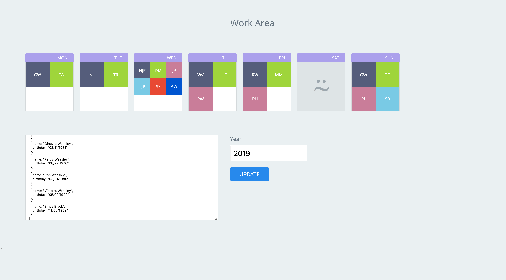

# Birthday-Calendar &nbsp;&nbsp;&nbsp; [](https://travis-ci.org/girdhariag/birthdaycalendar)
To group the birthdays on the basis of the weekday for that year.

birthdaycalendar is a tool that accepts the birthday data and the current year of computation from the user and renders the initials of the people who's birthdays fall on any given day.

People inside a week-card are sorted in the order of their age (youngest to oldest).  
All people in a week-card is a square box and occupies same amount of space and fill up as much space in the card as possible.


[Sample](./sample/sample-input.txt) birthday data:
```
[
  {
    name: "Dudley Dursley",
    birthday: "06/30/1980"
  },
  {
    name: "Hermione Granger",
    birthday: "09/19/1979"
  },
  {
    name: "Rubeus Hagrid",
    birthday: "12/06/1928"
  },
  {
    name: "Neville Longbottom",
    birthday: "07/30/1980"
  },
  {
    name: "George Weasley",
    birthday: "04/01/1978"
  },
  {
    name: "Remus Lupin",
    birthday: "03/10/1960"
  },
  {
    name: "Draco Malfoy",
    birthday: "06/05/1980"
  },
  {
    name: "Minerva McGonagall",
    birthday: "10/04/1935"
  },
  {
    name: "Harry James Potter",
    birthday: "07/31/1980"
  },
  {
    name: "Lily James Potter",
    birthday: "01/30/1960"
  },
  {
    name: "James Potter",
    birthday: "03/27/1960"
  },
  {
    name: "Tom Riddle",
    birthday: "12/31/1926"
  },
  {
    name: "Severus Snape",
    birthday: "01/09/1960"
  },
  {
    name: "Arthur Weasley",
    birthday: "02/06/1951"
  },
  {
    name: "Fred Weasley",
    birthday: "04/01/1978"
  },
  {
    name: "Ginevra Weasley",
    birthday: "08/11/1981"
  },
  {
    name: "Percy Weasley",
    birthday: "08/22/1976"
  },
  {
    name: "Ron Weasley",
    birthday: "03/01/1980"
  },
  {
    name: "Victoire Weasley",
    birthday: "05/02/1999"
  },
  {
    name: "Sirius Black",
    birthday: "11/03/1959"
  }
]
```

Sample output:



## Installation
This application doesn't require any installation as such. It just requires a web browser to run it.

## Usage
Download this repository and open the index.html at the root folder of the repository and that is enough to use this application.

## Testing
Basic tests have been included to check the functionality of the application.
We are using [Jest](https://jestjs.io/) to test our application.

Additionally, we have added eslint rules that will be run on commit push.
### Running tests
1. run `yarn` to install the dependencies to run the test cases
```
yarn
```
2. run `yarn test` to run the test cases.
```
yarn test
```
